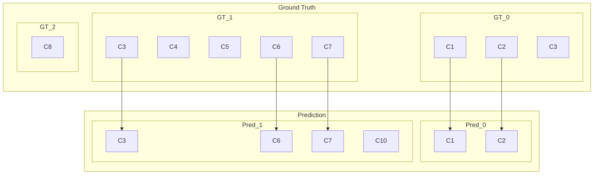

# PlasEval

<!--
[![PyPI][pypi_badge]][pypi_link]
[![Python][python_badge]][pypi_link]
-->
[![uv][uv_badge]][uv_link]
[![CI][ci_badge]][ci_link]
[![Coverage][cov_badge]][cov_link]
[![License][license_badge]][license_link]

PlasEval is a tool aimed at evaluating the accuracy and at comparing methods for the problem of **plasmid binning**.

**Table of content:**

* [Background: plasmid binning](#background-plasmid-binning)
* [Installation](#installation)
  * [Via pip](#via-pip)
  * [Docker](#docker)
  * [Apptainer / Singularity](#apptainer--singularity)
* [Input: collection of plasmid bins](#input-collection-of-plasmid-bins)
* [Computing recall, precision and F1 scores (`eval` subcommand)](#computing-recall-precision-and-f1-scores-eval-subcommand)
  * [Usage](#usage)
  * [Options](#options)
  * [Output](#output)
* [Computing dissimilarity measure (`comp` subcommand)](#computing-dissimilarity-measure-comp-subcommand)
  * [Usage](#usage-1)
  * [Options](#options-1)
  * [Output](#output-1)
  * [Technical notes](#technical-notes)
* [Example](#example)
* [Reference](#reference)

## Background: plasmid binning

Plasmid binning aims at detecting, from the draft assembly of a single isolate bacterial pathogen, groups of contigs assumed each to originate from a plasmid present in the sequenced isolate. Recent methods for plasmid binning include [PlasBin-Flow](https://github.com/cchauve/PlasBin-flow), [MOB-recon](https://github.com/phac-nml/mob-suite) and [gplas](https://gitlab.com/sirarredondo/gplas).

The result of applying a plasmid binning method to a draft assembly is a collection of unordered groups of contigs, called **plasmid bins**.

## Installation

### Via pip

```sh
# At this repository root
pip install .
```

### Docker

To build the image (unnecessary if you can download it from quay)

```sh
docker build -t plaseval .
```

Run with a bind mount to exchange input/output data with the host. The example below mounts the `examples/` directory at `/data` inside the container and runs the evaluation mode:

```sh
docker run --rm --user "$(id -u):$(id -g)" \
   -v "$(pwd)/examples:/data" plaseval:latest \
      eval \
         --pred /data/input/pred_bins.tsv \
         --gt /data/input/gt_bins.tsv \
         --out /data/output/P1G1_eval.tsv \
         --log /data/output/P1G1_eval.log
```

`--user` makes the output files owned by you rather than root. The
`/data/output` directory must exist and be writable.

With Podman, drop `--user` and add `:U` to the mount so the container user can
write to it:

```sh
podman run --rm -v "$(pwd)/examples:/data:U" plaseval:latest \
  eval \
    --pred /data/input/pred_bins.tsv \
    --gt /data/input/gt_bins.tsv \
    --out /data/output/P1G1_eval.tsv \
    --log /data/output/P1G1_eval.log
```

### Apptainer / Singularity

Build the SIF image:

```sh
apptainer build PlasEval.sif PlasEval.def
```

Run with a bind mount, same pattern as Docker:

```sh
apptainer run --bind examples:/data PlasEval.sif  \
  plaseval eval \
    --pred /data/input/pred_bins.tsv \
    --gt /data/input/gt_bins.tsv \
    --out /data/output/P1G1_eval.tsv \
    --log /data/output/P1G1_eval.log
```

## Input: collection of plasmid bins

The main input in both modes of PlasEval are two plasmid bins TSV files:

| Column name | Value   | Description                                             |
| ----------- | ------- | ------------------------------------------------------- |
| plasmid     | `<str>` | Identifier of a plasmid bin                             |
| contig      | `<str>` | Identifier of a contig that belongs to this plasmid bin |
| contig_len  | `<int>` | Length of the contig                                    |

An example is provided below that describes the collection of plasmid bins where bin `P1` contains contigs `C1` and `C2` and bin `P2` contains contigs `C1`, `C3` and `C4`.

```tsv
plasmid contig contig_len
P1      C1     2000
P2      C3     3000
P1      C2     2000
P2      C1     2000
P2      C4     2000
```

If a contig appears in several copies in a plasmid bin, the evaluation mode only accounts for one copy of the contig. The comparison mode can account for multiple copies of a contig in the same bin.

## Computing recall, precision and F1 scores (`eval` subcommand)

In the **evaluation**  mode of PlasEval, given a collection of *predicted plasmid bins* resulting from a plasmid binning tools and a *ground truth* collection of plasmid bins, where each true plasmid bin contains all the contigs that belong to one of the plasmid present in the sequenced isolate, PlasEval computes three statistics, the *precision*, the *recall* and the *F1-score* of the predicted plasmid bins with respect to the ground truth.

For a group $X$ of contigs, we denote by $L(X)$ the cumulated length of the contigs in $X$.
For a predicted plasmid bin $P$ and a ground truth plasmid bin $T$, we define the *overlap* between $P$ and $T$, denoted by $overlap(P,T)$, as the cumulated length of the contigs presents in both $P$ and $T$.

Given a collection $A$ of predicted plasmid bins and a collection $B$ of ground truth plasmid bins, we define the precision $p(A,B)$ and recall $r(A,B)$ as follows:

```math
p(A,B) = \frac{\sum\limits_{P\in A} \max\limits_{T\in B} overlap(P,T)}{\sum\limits_{P\in A}L(P)}, r(A,B) = \frac{\sum\limits_{T\in B} \max\limits_{P\in A} overlap(P,T)}{\sum\limits_{T\in B}L(T)}.
```

The F1-score is the arithmetic mean of the precision and recall:

```math
F_1(A,B) = 2\frac{{p}(A,B){r}(A,B)}{{p}(A,B)+{r}(A,B)}.
```

### Usage

```bash
plaseval eval --gt GROUNDTRUTH_BINS_TSV --pred PREDICTED_BINS_TSV --out OUT_FILE --log LOG_FILE [--min-len LEN_THRESHOLD]
```

### Options

* `--min-len` (default: `0`): minimum length of a contig to be considered in the evaluation.

### Output

Precision and recall statistics are computed for individual bins (`Individual` level).
The average precision, recall and F1 statistics are then computed for the overall sample (`Overall` level).

The output file is TSV file with the following columns:

| Column        | Values                        | Description                                                                                                                                                                                                                                                                        |
| ------------- | ----------------------------- | ---------------------------------------------------------------------------------------------------------------------------------------------------------------------------------------------------------------------------------------------------------------------------------- |
| `Level`       | `Individual` or `Overall`     | Level of the statistics                                                                                                                                                                                                                                                            |
| `Statistic`   | `Precision`, `Recall` or `F1` | Type of the statistic                                                                                                                                                                                                                                                              |
| `Bin`         | `<str>` or `None`             | For the `Individual` level, we compute the precision for each predicted plasmid bin and the recall for each ground truth plasmid bin. The identity of the bin (predicted or ground truth) is given in this column. Note that this column is empty for `Overall` sample statistics. |
| `Unwtd_Stat`  | `<float>`                     | Contig-level statistics for an individual bin or for the overall sample                                                                                                                                                                                                            |
| `Unwtd_Match` | `<str>` or `None`             | Best bin match for the unweighted statistics (for `Individual` level), otherwise `None`                                                                                                                                                                                            |
| `Wtd_Stat`    | `<float>`                     | Basepair-level statistics for an individual bin or for the overall sample                                                                                                                                                                                                          |
| `Wtd_Match`   | `<str>` or `None`             | Best bin match for the weighted statistics (for `Individual` level), otherwise `None`                                                                                                                                                                                              |

For `Unwtd_Match` and `Wtd_Match` columns:

* For `Statistic` column value `Precision`, this column will have the ground truth bin that best matches the predicted bin from the `Bin` column.
* For `Statistic` column value `Recall`, this column will have the predicted bin that best matches the ground truth bin from the `Bin` column.

## Computing dissimilarity measure (`comp` subcommand)

In the **comparison** mode of PlasEval, given two collections of *predicted plasmid bins* (either resulting from two plasmid binning tools or from a plasmid binning tool and a ground truth), PlasEval computes three statistics, PlasEval computes a *dissimilarity measure* that indictaes how much both collections of predicted plasmid bins are in agreement.
The full details of the dissimilarity measure computed by PlasEval are available in the preprint *[PlasEval: a framework for comparing and evaluating plasmid binning tools](https://link.springer.com/article/10.1186/s12859-024-05941-0)* and we describe below its general principle.
The dissimilariy value is the sum of 4 terms accounting respectively for

* *extra contigs*: the contigs present in $A$ but not in $B$;
* *missing contigs*: the contigs present in $B$ but not in $A$;
* *splits*: splitting of the plasmid bins of $A$ to obtain a collection of intermediate bins defined as the intersection of $A$ and $B$;
* *joins*: joining the splitted plasmid bins into the plasmid bins of $B$.

Each of these components incur a *cost*, parameterized by a parameter $\alpha \in [0,1]$:

* each extra or missing contig $c$ results in a cost $\ell(c)^\alpha$, where $\ell(c)$ is the length of $c$;
* each split of a plasmid bin $P$ into two smaller bins $P'$ and $P''$ results in a cost $\min(L(P')^\alpha,L(P'')^\alpha)$;
* each join of two intermediate plasmid bins $P',P''$ into larger bin $P$ results in a cost $\min(L(P')^\alpha,L(P'')^\alpha)$.

So with $\alpha=0$, the length of contigs is not accounted for and only collection-theoretic operations define the dissimilarity value, while with $\alpha=1$ it is fully accounted for.
By default $\alpha=0.5$.

In the case where some contigs are *repeated*, i.e. a contig appears in more than one plasmid bin of $A$ and/or $B$, a *branch-and-bound* algorithm computes the pairing between repeats contigs in $A$ and in $B$ that results in the minimum dissimilarity value.

Finally the dissimilarity obtained as described above is *normalized* into a value in $[0,1]$ by dividing it by

```math
\sum\limits_{P\in A}\sum\limits_{c\in P} \ell(c)^{\alpha} + \sum\limits_{Q\in B}\sum\limits_{c\in Q} \ell(c)^{\alpha}.
```

### Usage

```bash
plaseval comp --gt GROUNDTRUTH_BINS_TSV --pred PREDICTED_BINS_TSV --out OUT_FILE --log LOG_FILE [--min-len LEN_THRESHOLD --alpha ALPHA]
```

### Options

* `--min-len` (default: `0`): minimum length of a contig to be considered in the evaluation.
* `--alpha` (default: `0.5`): $\alpha$ parameter.

### Output

The output file (TSV) for the compare mode contains the following information:

1. `Total_ctg_length`: Cumulative length of contigs present in at least one of collection of plasmid bins.
2. `Total_ctg_length_alpha`: Cumulative dissimilarity cost of all contigs from (a).
3. `Cuts`: (Cost of cuts) cost of splitting bins from the first collection of plasmid bins.
4. `Joins`: (Cost of joins) cost of splitting bins from the second collection of plasmid bins.
5. `Extra_ctgs`: Cumulative length of contigs present only in the first collection.
6. `Missing_ctgs`: Cumulative length of contigs present only in the second collection.
7. `Dissimilarity`: Dissimilarity score

The compare mode also provides a log file with some other details related to the comparison algorithm. These include the maximum number of matchings possible, the time taken to execute the method, the number of recursive function calls made during the comparison and finally the actual matching between contigs of both collections of plasmid bins that yields the dissimilarity score in the output file described above.

For `Cuts`, `Joins`, `Extra_ctgs`, `Missing_ctgs` and `Dissimilarity`, the second column corresponds to the unnormalized value, while the third one corresponds to the normalized value.

```tsv
Total_ctg_length        <float>
Total_ctg_length_alpha  <float>
Cuts                    <float>  <float>
Joins                   <float>  <float>
Extra_ctgs              <float>  <float>
Missing_ctgs            <float>  <float>
Dissimilarity           <float>  <float>
```

### Technical notes

The branch-and-bound search always runs to completion; there is no iteration limit.

## Example

In `examples` directory there are two colelctions of plasmid bins to compare:

* `examples/input/gt_bins.tsv`: ground truth bins
* `examples/input/pred_bins.tsv`: predicted bins

The following diagramm show the differences between the ground-truth and the prediction:



Particularly:

* Contig `C3` is present in ground truth bins `GT_0` and `GT_1` but only in `Pred_1`.
* Contigs `C4` and `C5` in `GT_1` and contig `C8` in `GT_2` are not present in any predicted bin (missing contigs).
* Contig `C10` in `Pred_1` is an extra contig.

```sh
#
# Recall, precision and F1 evaluations
#
plaseval eval --gt examples/input/gt_bins.tsv --pred examples/input/pred_bins.tsv --out tmp/eval_example.tsv --log tmp/eval_example.log
#
# Dissimilarity measure computation
#
plaseval comp --gt examples/input/gt_bins.tsv --pred examples/input/pred_bins.tsv --out tmp/comp_example.out --log tmp/comp_example.log
```

An example of output files can be found in the `examples/output/` directory.

## Reference

Mane, A., Sanderson, H., White, A.P. *et al.* Plaseval: a framework for comparing and evaluating plasmid detection tools. *BMC Bioinformatics* **25**, 365 (2024). <https://doi.org/10.1186/s12859-024-05941-0>

<!-- Badges -->

<!--
Changes:

* PyPI project name `plaseval`
* GitHub repo `gdv/PlasEval`
-->

<!--
[pypi_badge]: https://img.shields.io/pypi/v/plaseval?style=for-the-badge&logo=python&color=blue "Package badge"
[pypi_link]: https://pypi.org/project/plaseval/ "Package link"

[python_badge]: https://img.shields.io/pypi/pyversions/plaseval?style=for-the-badge&logo=python&logoColor=white "Python versions badge"
-->

[uv_badge]: https://img.shields.io/endpoint?url=https%3A%2F%2Fraw.githubusercontent.com%2Fastral-sh%2Fuv%2Fmain%2Fassets%2Fbadge%2Fv0.json&style=for-the-badge "uv badge"
[uv_link]: https://docs.astral.sh/uv/ "uv link"

[ci_badge]: https://img.shields.io/github/actions/workflow/status/gdv/PlasEval/ci.yml?branch=main&style=for-the-badge&logo=githubactions&logoColor=white&label=CI "CI badge"
[ci_link]: https://github.com/gdv/PlasEval/actions/workflows/ci.yml "CI link"

[cov_badge]: https://img.shields.io/endpoint?url=https%3A%2F%2Fraw.githubusercontent.com%2FOWNER%2FREPO%2Fbadges%2Fcoverage.json&style=for-the-badge&logo=pytest&logoColor=white "Coverage badge"
[cov_link]: https://github.com/gdv/PlasEval/actions/workflows/ci.yml "Coverage link"

[license_badge]: https://img.shields.io/github/license/gdv/PlasEval?style=for-the-badge&color=green "Licence badge"
[license_link]: https://github.com/gdv/PlasEval/blob/main/LICENSE "Licence link"
